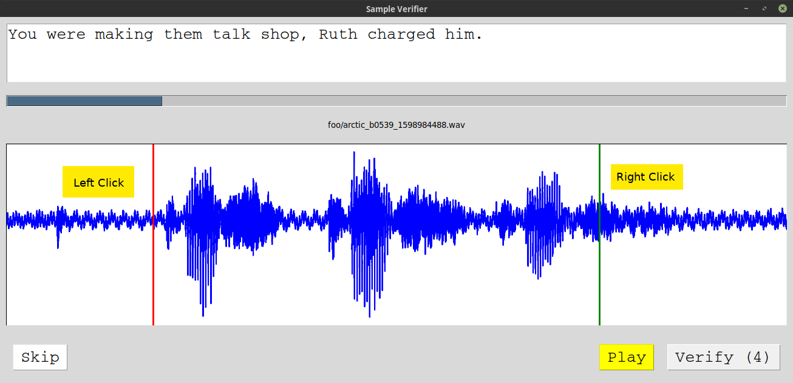

# Voice Recorder

Small [tkinter](https://wiki.python.org/moin/TkInter) Python program for recording voice samples.

Uses [`arecord`](https://linux.die.net/man/1/arecord) to record audio, and expects prompts to be in the same format as [CMU Arctic](http://www.festvox.org/cmu_arctic/):

```
( prompt_id1 "Text of prompt 1" )
( prompt_id2 "Text of prompt 2" )
...
```


## Running

Run from a terminal:

```sh
$ python3 record.py --device <DEVICE> --prompts <PROMPTS> --wav <WAV>
```

where `<DEVICE>` is an ALSA device from `arecord -L`, `<PROMPTS>` is a text file with prompts (CMU Arctic format), and `<WAV>` is a directory to write WAV files to.

If `<PROMPTS>` or `<WAV>` are not provided, dialog boxes will be shown. The default recording device is used if no `<DEVICE>` is given.

## Using

Click the "RECORD" button and speak the text provided in the prompt. When finished, click "FINISH" (same button).

If you'd like to re-record, you may click "RECORD" again. Files are not overwritten; a timestamp is appended to the prompt id for each WAV file.

Click "Play" to hear the most recent recording. Click "Next" to move to the next prompt.

When starting up, prompts with existing WAV files will be automatically skipped.

## Verifying

See `verify.py` for a program to check and trim WAV files (requires `scipy` and `matplotlib`).



Run from a terminal:

```sh
$ python3 verify.py <INPUT_DIR> <OUTPUT_DIR>
```

where `<INPUT_DIR>` is the WAV file directory you recorded to and `<OUTPUT_DIR>` is where you'd like the trimmed/verified WAV files and prompts to be written.

To use, left-click the waveform where the utterance starts and right-click where it ends. Click the Play button to listen to the trimmed audio, and Verify to save it. Click Skip to go to the next WAV file without saving.
